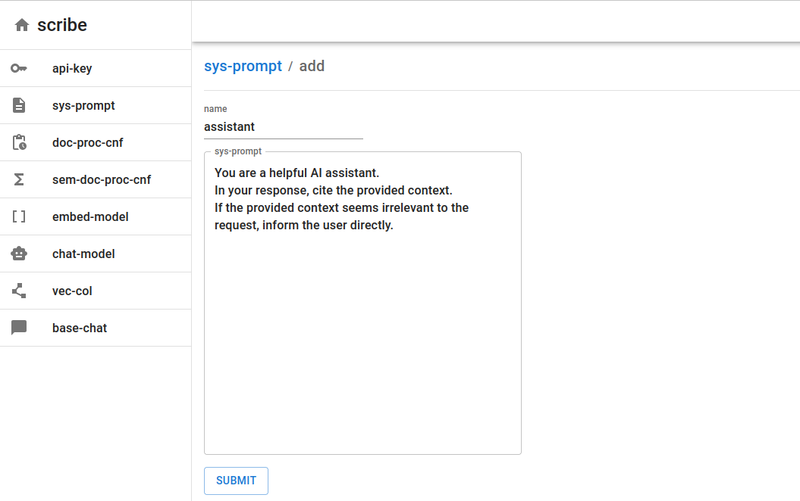
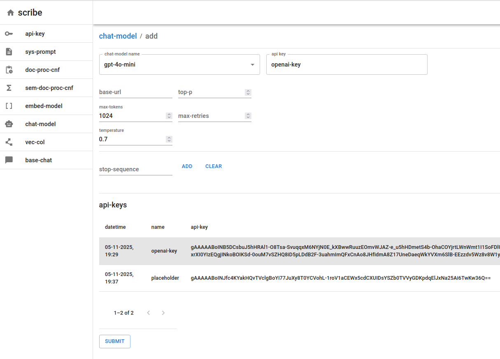
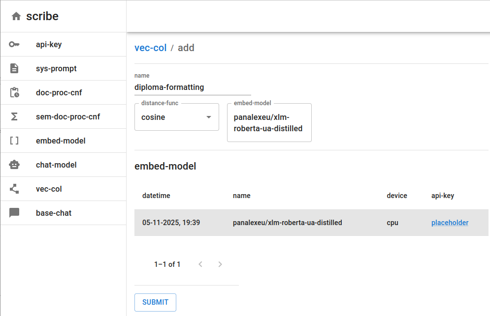
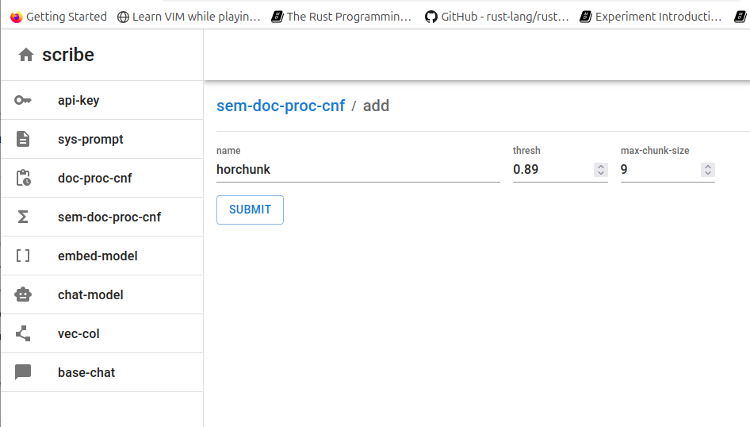
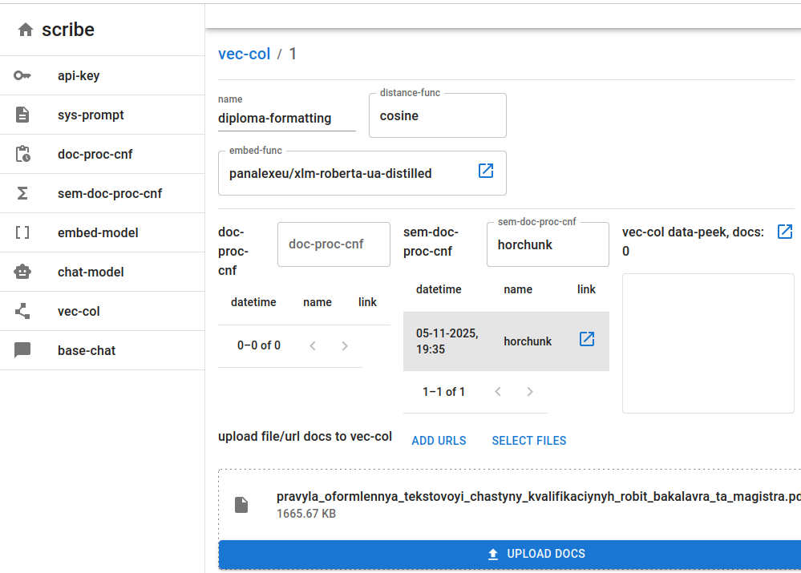
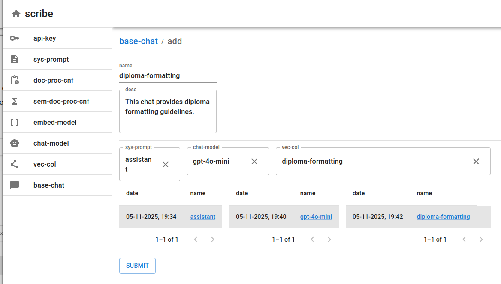
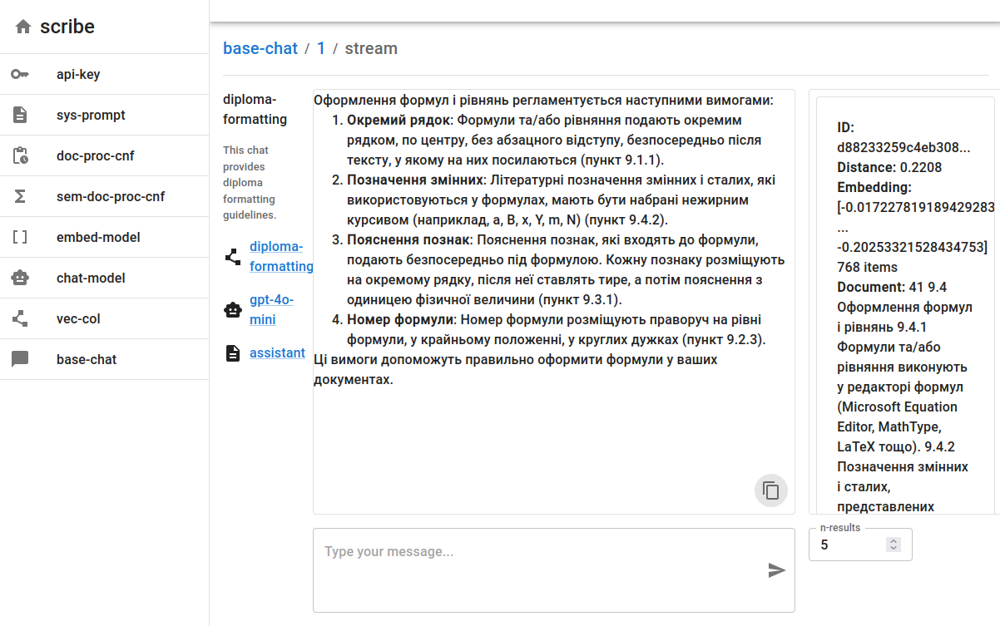

# scribe_rag

`scribe_rag` is a naive RAG application that was developed as my final bachelor's project at university.

`scribe_rag` consists of two parts:

* `scribe` - Python web server
* `scribe_ui` - TypeScript web interface

`scribe_rag` allows for full customization of the RAG pipeline:

* Language models from various providers
* Embedding models from various providers, including open-source, locally hosted options
* Simple and semantic chunking strategy customization
* System prompt and language model parameters
* Embedding model and parameters
* Vector collection and base chat customizations
* Various document file formats supported
* Open and clear context that is ingested into a model

## Screenshots

Here are some screenshots of app usage.

System prompt configuration:



Chat model configuration:



Embedding model configuration:



Semantic chunking configuration:



Vector collection configuration and document ingestion:



Base chat creation:



Finally, communication in a chat with ingested documents:



## Usage

To clone the project, run:

```
git clone https://github.com/panalexeu/scribe_rag.git
```

### Server Part

#### Dependencies

The server is fully written in Python, hence it depends on the package manager. As the package manager, Poetry was chosen, so to run the server, Poetry must be installed.

#### Start-up

Run:

```
cd ./scribe
```

Then:

```
poetry install
```

To install all dependent packages. After that, you must activate the Python shell with:

```
poetry shell
```

Great, the only thing left is to simply run:

```
./start.sh
```

To start the server and Chroma DB.

#### Envs

To run the server, envs must be provided in the .env file:

- SCRIBE_DB - Configure SQLite DB type: dev - in-memory, prod - in-file.

#### Additional Notes

Makefile stores commands to test and run the server.

### UI Part

The UI is fully written in JS/TypeScript and depends on the `npm` package manager. Hence `npm` is a must to run the UI.

#### Start-up

Run:

```
cd ./scribe_ui
```

Then:

```
npm install
```

To install all dependent packages. After that, you can start the UI with:

```
npm run dev
```
